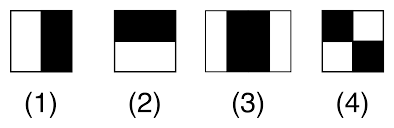
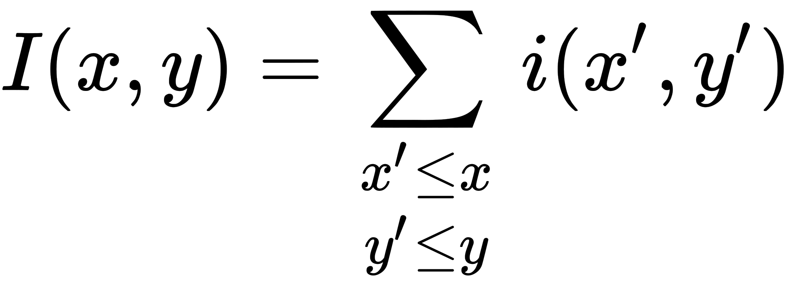
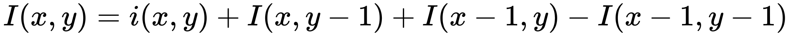
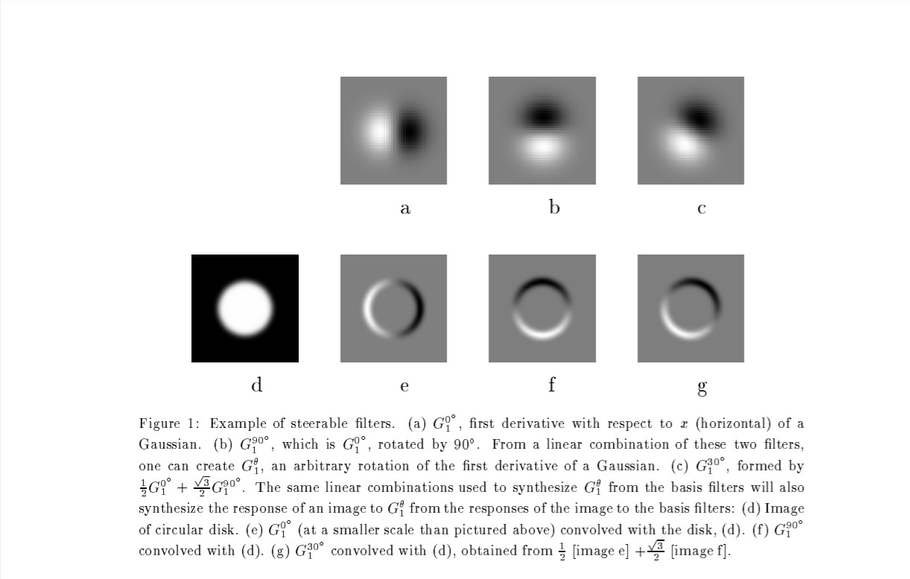

# Haarcascades

## Table of Contents

<!-- - [Haarcascades](#haarcascades)
  - [Table of Contents](#table-of-contents)
  - [1. Introduction](#1-introduction)
  - [2. Features](#2-features)
    - [2. 1. What are Haar features?](#2-1-what-are-haar-features)
    - [2. 2. Pros & Cons](#2-2-pros--cons)
      - [2. 2. 1. Pros](#2-2-1-pros)
      - [2. 2. 2. Cons](#2-2-2-cons)
    - [2. 3. Integral Image (Summed Area Table)](#2-3-integral-image-summed-area-table)
      - [2. 3. 1. The algorithm](#2-3-1-the-algorithm)
    - [2. 4. Feature Discussion](#2-4-feature-discussion)
  - [3. Learning Classification Functions](#3-learning-classification-functions)
    - [3. 1. Learning Discussion](#3-1-learning-discussion)
    - [3. 2. Learning Results](#3-2-learning-results)
  - [4. The Attentional Cascade](#4-the-attentional-cascade)
    - [4. 1. Training a Cascade of Classifiers](#4-1-training-a-cascade-of-classifiers)
    - [4. 2. Detector Cascade Discussion](#4-2-detector-cascade-discussion)
  - [5. Results](#5-results)
  - [6. Conclusions](#6-conclusions)
  - [7. References](#7-references)
    - [7. 1. The Viola-Jones Paper](#7-1-the-viola-jones-paper)
    - [7. 2. Haar features](#7-2-haar-features)
    - [7. 3. Integral Image](#7-3-integral-image)
    - [7. 4. Steerable Filters](#7-4-steerable-filters) -->

## 1. Introduction

## 2. Features

### 2. 1. What are Haar features?

[This article](https://towardsdatascience.com/whats-the-difference-between-haar-feature-classifiers-and-convolutional-neural-networks-ce6828343aeb) summarizes the concept best
> A Haar-Feature is just like a kernel in CNN, except that in a CNN, the values of the kernel are determined by training, while a Haar-Feature is manually determined.

There are in all **four** types of Haar-features.

- The first two features are used to detect edges.
- The third feature is used to detect lines.
- The fourth feature detects slants, called a rectangle feature.

The kernels can look something like this

- First feature
    | _-1_ | _-1_ | **5** |
    | ---- | ---- | ----- |
    | _-1_ | _-1_ | **5** |
    | _-1_ | _-1_ | **5** |

- Second feature
    | **5** | **5** | **5** |
    | ----- | ----- | ----- |
    | _-1_  | _-1_  | _-1_  |
    | _-1_  | _-1_  | _-1_  |

- Third feature
    | _-1_ | **5** | _-1_ |
    | ---- | ----- | ---- |
    | _-1_ | **5** | _-1_ |
    | _-1_ | **5** | _-1_ |

- Fourth feature
    | **5** | _-1_  | _-1_  |
    | ----- | ----- | ----- |
    | _-1_  | **5** | _-1_  |
    | _-1_  | _-1_  | **5** |

As we do in CNNs, this 3x3 kernel moves across the image, performing some matrix multiplication operations, emphasizing some features and smoothing others. [[1]](#hf1)

Haar features specialize in extracting edges, lines, slants in an image. This makes them extremely useful in face detection. It can detect on our faces, with sufficiently good lighting, our eyes, nose, and the face boundary.

### 2. 2. Pros & Cons

#### 2. 2. 1. Pros

- Don't have to train the entire Haar kernel every time, can retrain the weights on a small dataset as well.

#### 2. 2. 2. Cons

- Since the weights are manually determined, and have the special ability of edge and line detection, there may be some error while performing the task on a subject which does not have clear lines and edges.
  - For example, if the lighting is low, or the subject wears sunglasses, the haar features may not be sufficient enough to detect defining features.

### 2. 3. Integral Image (Summed Area Table)

The concept is not as difficult as it sounds.

It is an effective way of calculating the sum of pixel values in a given image - or a rectangular subset of a grid (the given image). [[2]](#ii1).

This is then used for calculating the average intensity within the grid. It is preferred that the image is grayscale first.

#### 2. 3. 1. The algorithm

What it simply says, is, <b>the value at any point (x, y) in the summed-area table is the sum of all the pixels above and to the left of (x, y), inclusive.</b> [[3]](#ii3)

Time complexity-wise, this can be done easily.

We can simply get the value of a pixel in an II by adding the value of the pixel, the II value of the pixel to its left, the II value of the pixel above it, and subtracting the II value of the pixel which is directly top-left of it.

For simplicity reasons, we begin to calculate the II values from the top-left corner of the image.

Instead of just the pixels, we can also add the II values of smaller II's inside an image. Sounds a bit complicated, right? [This link](#ii1) can explain it to you in an easier way.

The recurrence relation

<i><var>s(x, y) = s(x, y - 1) + i(x, y)</var></i>

<var><i>ii(x, y) = ii(x - 1) + s(x, y)</i></var>

(sort of the same equation as above), is used to compute the II in one-pas over the image.[[4]](#ii4) Time-complexity is <var>O(1)</var>.

### 2. 4. Feature Discussion

Rectangular features are primitive compared to **_Steerable filters_**[[5]](#SF1).

## 3. Learning Classification Functions

### 3. 1. Learning Discussion

### 3. 2. Learning Results

## 4. The Attentional Cascade

### 4. 1. Training a Cascade of Classifiers

### 4. 2. Detector Cascade Discussion

## 5. Results

## 6. Conclusions

## 7. References

### 7. 1. The Viola-Jones Paper

1. [Rapid Object Detection using a Boosted Cascade of Simple
Features](https://www.cs.cmu.edu/~efros/courses/LBMV07/Papers/viola-cvpr-01.pdf)

### 7. 2. Haar features

1. [What's the difference between Haar-feature classifiers and Convolutional Neural Networks?](https://towardsdatascience.com/whats-the-difference-between-haar-feature-classifiers-and-convolutional-neural-networks-ce6828343aeb)
2. [What are Haar features used in Face Detection?](https://medium.com/analytics-vidhya/what-is-haar-features-used-in-face-detection-a7e531c8332b)

### 7. 3. Integral Image

1. [Computer Vision - The Integral Image](https://computersciencesource.wordpress.com/2010/09/03/computer-vision-the-integral-image/)
2. [integralImage](https://in.mathworks.com/help/images/ref/integralimage.html)
3. [Summed Area Table](https://en.wikipedia.org/wiki/Summed-area_table)
4. [Integral image-based representations](http://www.cse.yorku.ca/~kosta/CompVis_Notes/integral_representations.pdf)

### 7. 4. Steerable Filters

1. [The Design and Use of Steerable filters](http://robots.stanford.edu/cs223b04/SteerableFiltersfreeman91design.pdf)
